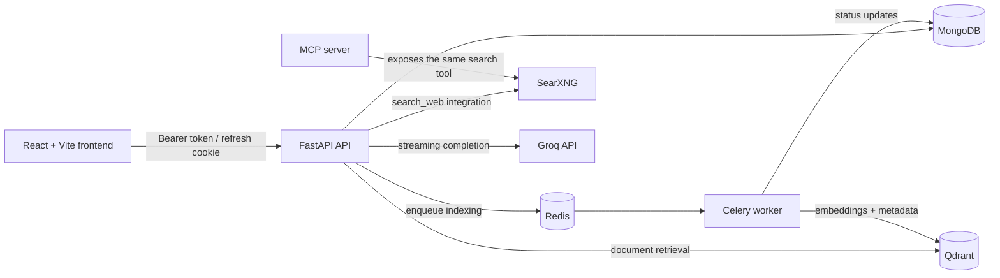
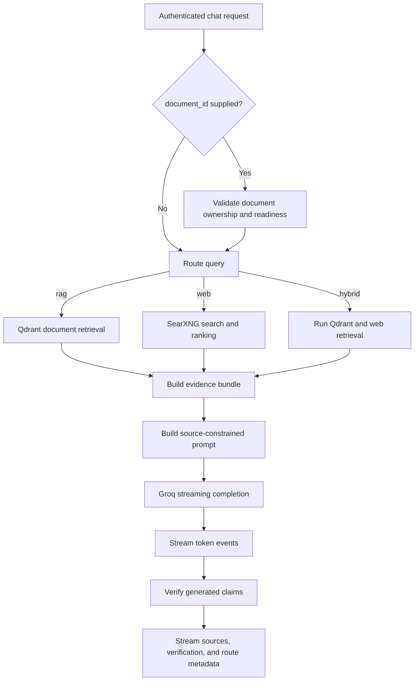
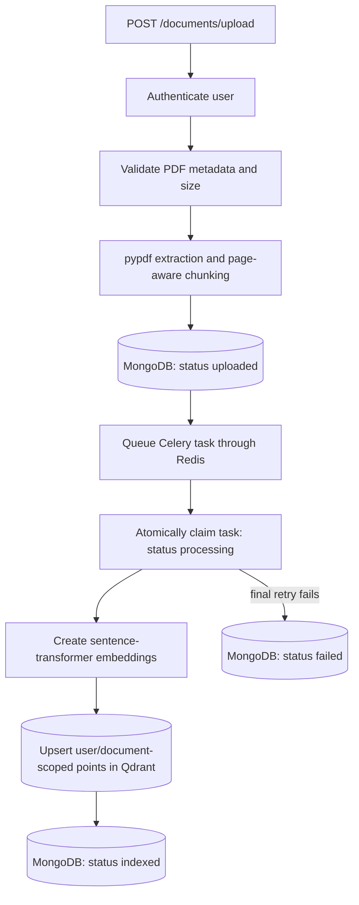
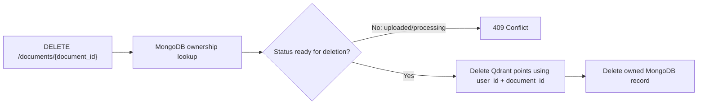

# AskLaw

AskLaw is a local-first legal research workspace for authenticated users. It combines persistent PDF document research, current web research, streamed AI answers, backend-generated source metadata, and deterministic evidence verification in one React and FastAPI application.

AskLaw is intended for educational and informational legal research. It does not replace qualified legal counsel and should not be treated as a source of legal advice.

## Contents

- [What AskLaw does](#what-asklaw-does)
- [Architecture](#architecture)
- [Research pipeline](#research-pipeline)
- [Document lifecycle](#document-lifecycle)
- [Technology stack](#technology-stack)
- [Project structure](#project-structure)
- [Prerequisites](#prerequisites)
- [Local setup](#local-setup)
- [Environment variables](#environment-variables)
- [API overview](#api-overview)
- [Document-scoped research](#document-scoped-research)
- [Verification](#verification)
- [Testing](#testing)
- [Evaluation](#evaluation)
- [Security](#security)
- [Known limitations](#known-limitations)
- [Development notes](#development-notes)
- [Deployment considerations](#deployment-considerations)

## What AskLaw does

### Authentication and sessions

- Email/password signup and login with bcrypt password hashing.
- Short-lived JWT access tokens and longer-lived JWT refresh tokens with separate token purposes.
- Access tokens are sent as Bearer tokens; refresh tokens are stored in an HttpOnly, `SameSite=Lax` cookie scoped to `/auth`.
- The frontend performs one shared refresh attempt after a protected request receives `401`, retries that request once, and clears the local session after a terminal refresh failure.
- Protected routes restore the user session through `GET /auth/me` and distinguish an invalid session from a temporarily unavailable API.

### Document workspace

- Persistent, user-scoped document library backed by MongoDB.
- PDF-only uploads with filename, MIME type, upload-size, page-count, and extracted-text limits.
- Page-aware text extraction and overlapping chunks.
- Asynchronous embedding and Qdrant indexing through Celery and Redis.
- Visible `uploaded`, `processing`, `indexed`, and `failed` states.
- User-scoped deletion from both Qdrant and MongoDB.
- A **Research** action that opens the normal chat workspace with a selected `document_id` preserved in the URL.

### Evidence-based chat

- Persistent conversations and message history.
- Deterministic routing among local-document RAG, web research, and hybrid retrieval.
- Qdrant similarity search with exact legal-provision handling for Article references.
- SearXNG web search, targeted search expansion for recent legal developments, and deterministic source ranking.
- Unified evidence normalization, deduplication, grouping, and conflict signals.
- Groq answer generation streamed to the UI as NDJSON events.
- Backend-generated document and web source metadata; the model does not create the source list.
- Post-generation claim verification with `supported`, `partial`, and `unsupported` classifications and a grounding score.

## Architecture



The FastAPI process imports the `search_web` tool function directly for the current research flow. `start.sh` also exposes that function through a separate local MCP server at `http://127.0.0.1:8001/mcp`.

MongoDB stores users, conversations, extracted document text, page-aware chunks, indexing status, and document metadata. Qdrant stores embeddings with `user_id`, `document_id`, filename, page, chunk index, and source text in each point payload. Redis is Celery's broker and result backend.

## Research pipeline



The query router uses deterministic text signals:

- **RAG** for uploaded-document or legal-provision intent.
- **Web** for current, recent, procedural, or general legal questions.
- **Hybrid** when a query includes both document and current-web signals.

The backend returns newline-delimited JSON events. Answer tokens arrive first; authoritative sources, verification data, and the selected route follow after generation completes.

## Document lifecycle

### Upload and indexing



PDF validation, text extraction, and chunk creation are synchronous within the upload request. Only embedding creation and Qdrant indexing run asynchronously. The original PDF binary is not persisted by the current implementation; MongoDB stores extracted text and chunks.

The Celery task atomically claims an upload before indexing. Duplicate or redelivered tasks cannot re-index a document already handled by another task. A failed indexing attempt is retried up to two times with incremental delays before the document is marked `failed`.

### Deletion



Vector cleanup happens before MongoDB deletion so a Qdrant failure leaves the document record visible and retryable. Missing and unowned documents both return `404`.

## Technology stack

| Layer | Current technology |
| --- | --- |
| Frontend | React 19, React Router 7, Vite 8, Tailwind CSS 4, Axios, React Markdown |
| Backend | Python, FastAPI, Pydantic, Uvicorn |
| Primary database | MongoDB 8 via PyMongo |
| Vector database | Qdrant via `qdrant-client` |
| Embeddings | Sentence Transformers; default `sentence-transformers/all-MiniLM-L6-v2` |
| Task queue | Celery with Redis broker/result backend |
| Web research | SearXNG through the AskLaw `search_web` MCP tool function |
| LLM | Groq API using `openai/gpt-oss-120b` in the current implementation |
| Authentication | bcrypt, JWT (`python-jose`), OAuth2 Bearer dependency, HttpOnly refresh cookie |
| PDF processing | `pypdf` |
| Containers | Docker Compose |
| Testing | Python `unittest`, Node test runner, ESLint, Vite build, custom evaluation harness |

## Project structure

```text
AskLaw/
├── backend/
│   ├── app/
│   │   ├── api/                 # FastAPI route handlers
│   │   ├── core/                # Settings, auth dependency, Celery app
│   │   ├── db/                  # MongoDB collections and indexes
│   │   ├── mcp/                 # SearXNG-backed MCP search tool
│   │   ├── schemas/             # Bounded request models
│   │   ├── services/            # Auth, documents, retrieval, evidence, AI, verification
│   │   ├── tasks/               # Celery document indexing task
│   │   └── main.py              # FastAPI application
│   ├── evaluation/              # Curated offline/live evaluation harness
│   ├── tests/                   # Isolated backend unit/regression tests
│   ├── .env.example
│   └── requirements.txt
├── frontend/
│   ├── public/
│   ├── src/
│   │   ├── components/          # Shared and chat UI
│   │   ├── hooks/               # Conversation and streaming chat state
│   │   ├── layout/
│   │   ├── pages/               # Landing, auth, chat dashboard, documents
│   │   ├── routes/              # Public/protected routes
│   │   └── services/            # API, auth, chat, conversation clients
│   ├── tests/                   # Frontend unit tests
│   ├── .env.example
│   └── package.json
├── docker-compose.yml           # MongoDB, Qdrant, Redis, SearXNG
├── start.sh                     # Starts the complete local stack
├── stop.sh                      # Stops local processes and containers
└── README.md
```

## Prerequisites

- Python 3. The repository does not pin a Python version; the current checkout was validated with Python 3.14.3.
- Node.js and npm. The installed toolchain declares Node `^20.19.0`, `^22.13.0`, or `>=24` support.
- Docker with the Compose plugin.
- A Groq API key for generated chat answers.
- A valid SearXNG `settings.yml` file for the Compose bind mount.
- Network access on first setup to install packages and download the configured sentence-transformer model.

MongoDB, Redis, Qdrant, and SearXNG are provided by Docker Compose; local installations are not required.

## Local setup

### 1. Clone and enter the repository

```bash
git clone https://github.com/akhhilreddy/AskLaw.git
cd AskLaw
```

### 2. Configure the backend

```bash
cd backend
python3 -m venv .venv
source .venv/bin/activate
python -m pip install -r requirements.txt
cp .env.example .env
```

Edit `backend/.env` before startup. At minimum, replace `SECRET_KEY` with a long random value and set `GROQ_API_KEY` for live answers. Do not commit this file.

Celery and its Redis transport are included in `backend/requirements.txt`.

### 3. Configure the frontend

```bash
cd ../frontend
npm ci
cp .env.example .env
cd ..
```

The example frontend URL already targets the default local FastAPI address.

### 4. Configure portable Compose storage

The local Compose stack uses named MongoDB, Qdrant, Redis, and SearXNG cache
volumes by default. To keep using existing bind-mounted MongoDB or Qdrant data,
define their absolute paths in the root Compose `.env`:

```dotenv
ASKLAW_MONGODB_DATA=/absolute/path/to/asklaw-data/mongodb
ASKLAW_QDRANT_DATA=/absolute/path/to/asklaw-data/qdrant
```

The secret-free SearXNG configuration is included at
`deploy/searxng/settings.yml`. `ASKLAW_SEARXNG_SETTINGS` can still override it
for a custom local configuration.

### 5. Start AskLaw

```bash
./start.sh
```

The script starts:

- MongoDB, Qdrant, Redis, and SearXNG through Docker Compose;
- FastAPI with Uvicorn reload on `http://localhost:8000`;
- a Celery worker using `celery -A app.core.celery_app worker --loglevel=info --pool=solo`;
- the MCP server on `http://127.0.0.1:8001/mcp`;
- Vite on `http://localhost:5173`.

Open `http://localhost:5173`. FastAPI's generated API documentation is available at `http://localhost:8000/docs`.

Press `Ctrl+C` in the startup terminal, or run the following from another terminal:

```bash
./stop.sh
```

Both paths run `docker compose down`. Containers are removed, but named volumes
and any configured bind-mounted data are preserved.

## Environment variables

Keep backend runtime configuration in `backend/.env`, using `backend/.env.example` as the source of truth.

| Variable | Purpose | Required? | Safe example |
| --- | --- | --- | --- |
| `APP_NAME` | FastAPI application title | No; default exists | `AskLaw API` |
| `APP_ENV` | Runtime mode; `prod`/`production` activates stronger config checks | No; default exists | `development` |
| `API_VERSION` | API version shown by FastAPI | No; default exists | `1.0.0` |
| `SECRET_KEY` | Signs access and refresh JWTs | Yes | `<long-random-secret-at-least-32-characters>` |
| `ALGORITHM` | JWT HMAC algorithm; limited to HS256/384/512 | Yes | `HS256` |
| `ACCESS_TOKEN_EXPIRE_MINUTES` | Access-token lifetime | Yes | `30` |
| `REFRESH_TOKEN_EXPIRE_DAYS` | Refresh-token and cookie lifetime | Yes | `7` |
| `ALLOW_LEGACY_UNTYPED_REFRESH_TOKENS` | Temporary compatibility for old refresh cookies | No | `true` during migration; then `false` |
| `GEMINI_API_KEY` | Gemini embedding credential | Required when `EMBEDDING_PROVIDER=gemini` | leave empty for local embeddings |
| `GROQ_API_KEY` | Groq credential for generated answers | Required for chat answers | `your-groq-key` |
| `MONGODB_URL` | MongoDB connection URI | No; local default exists | `mongodb://localhost:27017` |
| `MONGODB_DATABASE` | MongoDB database name | No; local default exists | `asklaw` |
| `QDRANT_URL` | Qdrant HTTP endpoint | No; local default exists | `http://localhost:6333` |
| `QDRANT_COLLECTION_NAME` | Document-vector collection | No; local default exists | `asklaw_documents` |
| `EMBEDDING_PROVIDER` | Document/query embedding implementation | No; defaults to local | `local` or `gemini` |
| `EMBEDDING_MODEL` | Sentence Transformers model identifier | No; local default exists | `sentence-transformers/all-MiniLM-L6-v2` |
| `GEMINI_EMBEDDING_BATCH_SIZE` | Maximum texts in one Gemini embedding request | No | `32` |
| `CELERY_BROKER_URL` | Celery broker | No; local default exists | `redis://localhost:6379/0` |
| `CELERY_RESULT_BACKEND` | Celery result backend | No; local default exists | `redis://localhost:6379/1` |
| `CORS_ORIGINS` | Comma-separated trusted browser origins; wildcard is rejected | No; local default exists | `http://localhost:5173` |
| `COOKIE_SECURE` | Adds the refresh cookie `Secure` attribute | No; must be `true` in production | `false` locally |
| `MAX_DOCUMENT_UPLOAD_BYTES` | Maximum PDF upload size | No | `20971520` |
| `MAX_DOCUMENT_PAGES` | Maximum PDF page count | No | `500` |
| `MAX_DOCUMENT_TEXT_BYTES` | Maximum extracted UTF-8 text size | No | `5242880` |
| `SEARXNG_URL` | SearXNG JSON search endpoint | No; local default exists | `http://127.0.0.1:8080/search` |
| `MCP_HOST` | MCP server bind address | No | `127.0.0.1` |
| `MCP_PORT` | MCP server port | No | `8001` |

Production configuration rejects `COOKIE_SECURE=false`, a default secret, and secrets shorter than 32 characters.

The frontend reads `frontend/.env`:

| Variable | Purpose | Required? | Safe example |
| --- | --- | --- | --- |
| `VITE_API_BASE_URL` | FastAPI base URL used by Axios and streaming `fetch` | No; local fallback exists | `http://localhost:8000` |

The optional root Compose `.env` can override `ASKLAW_MONGODB_DATA`,
`ASKLAW_QDRANT_DATA`, and `ASKLAW_SEARXNG_SETTINGS` as described in
[Local setup](#4-configure-portable-compose-storage). These values are Docker
mount sources, not backend application settings.

## API overview

| Route | Authentication | Purpose |
| --- | --- | --- |
| `GET /health` | Public | Basic API health response |
| `POST /auth/signup` | Public | Create a user account |
| `POST /auth/login` | Public; trusted browser origin | JSON login, access token response, refresh cookie |
| `POST /auth/token` | Public; trusted browser origin | OAuth2 form login for API clients/Swagger |
| `POST /auth/refresh` | Refresh cookie; trusted browser origin | Issue a new access token |
| `GET /auth/me` | Bearer access token | Return the current user profile |
| `POST /auth/logout` | Trusted browser origin | Clear the refresh cookie |
| `GET /documents` | Bearer access token | List only the current user's documents, newest first |
| `POST /documents/upload` | Bearer access token | Upload the multipart `file` field and queue indexing |
| `DELETE /documents/{document_id}` | Bearer access token | Delete one owned document and its vectors |
| `/conversations/` | Bearer access token | Create/list conversations; fetch, update, rename, or delete by ID |
| `POST /chat/stream` | Bearer access token | Stream document, web, or hybrid research as NDJSON |

All document, conversation, and chat operations derive the user identity from the validated access token. The API does not accept a client-provided `user_id` as authorization evidence.

## Document-scoped research

The document workspace links an indexed document to `/dashboard?document_id=<id>`. On direct navigation or refresh, the dashboard reloads the user's document list and resolves that ID to the visible filename.

```text
Documents page
  → Research
  → /dashboard?document_id=<id>
  → POST /chat/stream with document_id
  → MongoDB ownership/readiness validation
  → RAG or hybrid branch
  → Qdrant filter: user_id AND document_id
  → source-backed streamed answer
```

The frontend's `document_id` is a selector, not proof of ownership. FastAPI first looks up the document using both the ID and authenticated user ID. It returns `404` for an unowned document and `409` while indexing is incomplete or failed. Every Qdrant document lookup also includes the authenticated `user_id`; document-scoped retrieval adds `document_id` to that filter.

The selected ID constrains the document side of RAG and hybrid retrieval. A query that the deterministic router classifies as web-only uses web evidence and does not query the selected document. Normal chat omits `document_id` and remains scoped to all Qdrant chunks owned by the authenticated user when a RAG branch is selected.

## Verification

After the answer stream completes, the backend splits the generated answer into claims and compares each claim with the normalized evidence bundle. The verifier uses deterministic content overlap plus legal-identifier, numeric, contradiction, and unsupported-detail checks.

Each claim is classified as:

- `supported`: strong retrieved-evidence support;
- `partial`: related evidence exists, but support is incomplete;
- `unsupported`: the support threshold is not met or a deterministic contradiction guard applies.

The grounding score is the average of `1.0` for supported claims, `0.5` for partial claims, and `0.0` for unsupported claims. The frontend displays the score, category totals, and per-claim results.

Verification measures support against retrieved source material. It is not a substitute for legal judgment or a guarantee of substantive legal correctness.

## Testing

Run the isolated checks from the repository root.

### Backend compilation and unit suite

```bash
cd backend
.venv/bin/python -m compileall -q app tests evaluation
.venv/bin/python -m unittest -v tests.test_document_workspace tests.test_claim_verifier
```

The backend suite uses mocks/stubs and does not require Groq, MongoDB, Redis, Qdrant, SearXNG, or Celery network services. To run only claim-verifier regressions:

```bash
cd backend
.venv/bin/python -m unittest -v tests.test_claim_verifier
```

### Frontend tests, lint, and build

```bash
cd frontend
node --test tests/authError.test.js
npm run lint
npm run build
```

### Documentation/diff hygiene

```bash
git diff --check
```

Validated for this documentation update:

- backend compilation completed successfully;
- 63 backend tests passed;
- 9 frontend tests passed;
- frontend lint passed;
- the Vite production build passed.

For the live manual workflow—authentication, status transitions, streamed research, cross-user isolation, deletion, and all retrieval modes—see `backend/tests/README.md`.

## Evaluation

`backend/evaluation/` contains 12 curated cases covering document routing, web routing, hybrid routing, document isolation, and claim support. The harness reports observations per case and intentionally does not manufacture an aggregate accuracy percentage.

Run the offline deterministic evaluation:

```bash
cd backend
.venv/bin/python evaluation/run_evaluation.py
```

All 12 offline cases passed during this documentation update.

Live retrieval evaluation requires a running stack, an indexed document, and real MongoDB user IDs:

```bash
cd backend
.venv/bin/python evaluation/run_evaluation.py --live \
  --user-id USER_ID \
  --other-user-id SECOND_USER_ID \
  --document-id DOCUMENT_ID \
  --expected-filename document.pdf
```

Live mode checks the selected route, retrieval presence, source filenames, expected-source presence, and cross-user document isolation. It does not call Groq and does not assert that an answer is legally correct.

## Security

### Current local/development protections

- JWTs have explicit `access` and `refresh` purposes; protected endpoints accept access tokens only.
- A temporary flag gates compatibility with legacy refresh tokens that have no token-purpose claim.
- Refresh cookies are HttpOnly, `SameSite=Lax`, scoped to `/auth`, and can be marked `Secure` through configuration.
- Browser requests to cookie session endpoints are checked against the configured trusted origins.
- CORS requires explicit origins and allows credentials; wildcard configuration is rejected.
- MongoDB document and conversation operations include the authenticated `user_id`.
- Qdrant retrieval and deletion include a `user_id` filter; document-scoped operations also require `document_id`.
- User email has a unique MongoDB index, including duplicate-race handling.
- Signup passwords are bounded to bcrypt's 72-byte limit; chat, conversation, title, and message payloads are bounded.
- Uploads require a safe `.pdf` basename and `application/pdf` MIME type, then enforce byte, page, and extracted-text caps.
- Retrieved document and web content is explicitly marked as untrusted data in the model prompt, and the model is instructed not to follow embedded instructions.
- Backend source metadata is built from retrieval results rather than model-generated citations.
- Local Docker service ports bind to `127.0.0.1`.
- Normal application logs use operational counts, identifiers, and generic failure context rather than intentionally logging tokens or retrieved source bodies.

These controls describe the current local implementation. They do not make the repository production-ready.

### Before public deployment

- Add distributed rate limiting for authentication, upload, chat, and other costly endpoints.
- Add refresh-token rotation and revocation, or a server-side session/version mechanism.
- Serve only over HTTPS and set `APP_ENV=production` and `COOKIE_SECURE=true`.
- Restrict `CORS_ORIGINS` to the production frontend origins.
- Add a Content Security Policy, HSTS, and other appropriate security headers at the application or edge layer.
- Keep MongoDB, Redis, Qdrant, SearXNG, and Celery on private networks; add service authentication where supported.
- Pin container image versions instead of using `latest`.
- Store secrets in a managed secret store and rotate any exposed credential.
- Disable `ALLOW_LEGACY_UNTYPED_REFRESH_TOKENS` after the migration window.
- Review exception logging and provider error data before centralizing production logs.
- Add monitoring, audit events, backups, restore tests, dependency scanning, and incident-response procedures.

## Known limitations

- The claim verifier is deterministic and lightweight; it is not a semantic-entailment engine or a legal correctness oracle.
- Prompt boundaries reduce risk from malicious source content but cannot eliminate prompt-injection risk in an AI system.
- Refresh tokens are stateless and are neither rotated nor revoked server-side. Logout removes the browser cookie but does not invalidate an already-copied token.
- The browser access token is stored in `localStorage`.
- No built-in distributed rate limiting is present.
- PDF text extraction and chunking run synchronously in the upload request.
- Scanned/image-only PDFs are rejected because OCR is not implemented.
- Web research ranks SearXNG result metadata and snippets; it does not fetch and parse every result page.
- The local `docker-compose.yml` remains development-oriented; the separate
  production foundation has health checks and private service networking.
- The repository is not deployed and does not contain production secrets, DNS,
  cloud firewall configuration, backups, or monitoring credentials.
- Python and Node versions are pinned for the production images, not for direct
  host-based development.

## Development notes

- `start.sh` launches the whole local stack and writes process IDs to `.asklaw.pids`.
- Local logs are written to `/tmp/asklaw-fastapi.log`, `/tmp/asklaw-celery.log`, `/tmp/asklaw-mcp.log`, and `/tmp/asklaw-frontend.log`.
- The Celery worker uses the `solo` pool for the local workflow.
- `start.sh` starts services in sequence but does not wait for Docker service health checks before starting application processes.
- MongoDB, Qdrant, Redis, and SearXNG cache use named Docker volumes by default;
  existing MongoDB/Qdrant bind mounts remain available through overrides.
- `stop.sh` validates recorded process commands before signalling them, removes the PID file, and runs `docker compose down`.
- MongoDB indexes are created during the FastAPI lifespan for unique email and user-scoped document/conversation sorting.
- The Documents page polls `GET /documents` every three seconds while any document is `uploaded` or `processing`.
- The default chunk size is 1,000 characters with a 150-character overlap, preserving page numbers in every chunk.

## Deployment considerations

[`compose.production.yml`](compose.production.yml) and
[`deploy/README.md`](deploy/README.md) provide the ARM64 production-container
foundation. They separate the frontend/HTTPS proxy, API, worker, MCP, and
stateful services; keep internal services unpublished; use health checks,
rotating logs, pinned runtime tags, and persistent volumes; and pre-cache the
embedding model for local-provider builds. The default production example uses
Gemini embeddings and a separate 3072-dimensional Qdrant collection, avoiding
PyTorch and local model weights in that image.

This is not a public deployment. OCI provisioning, DNS, real secrets,
production origins, firewall rules, rate limiting, image scanning, monitoring,
backups, and restore procedures still need to be completed and validated before
launch.

The synchronous PDF extraction path should also be assessed against expected upload volume and moved behind an appropriately protected worker boundary if production load requires it.
