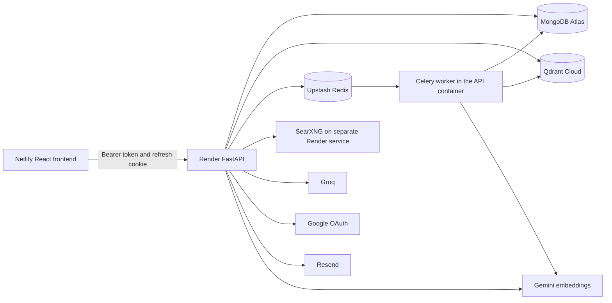
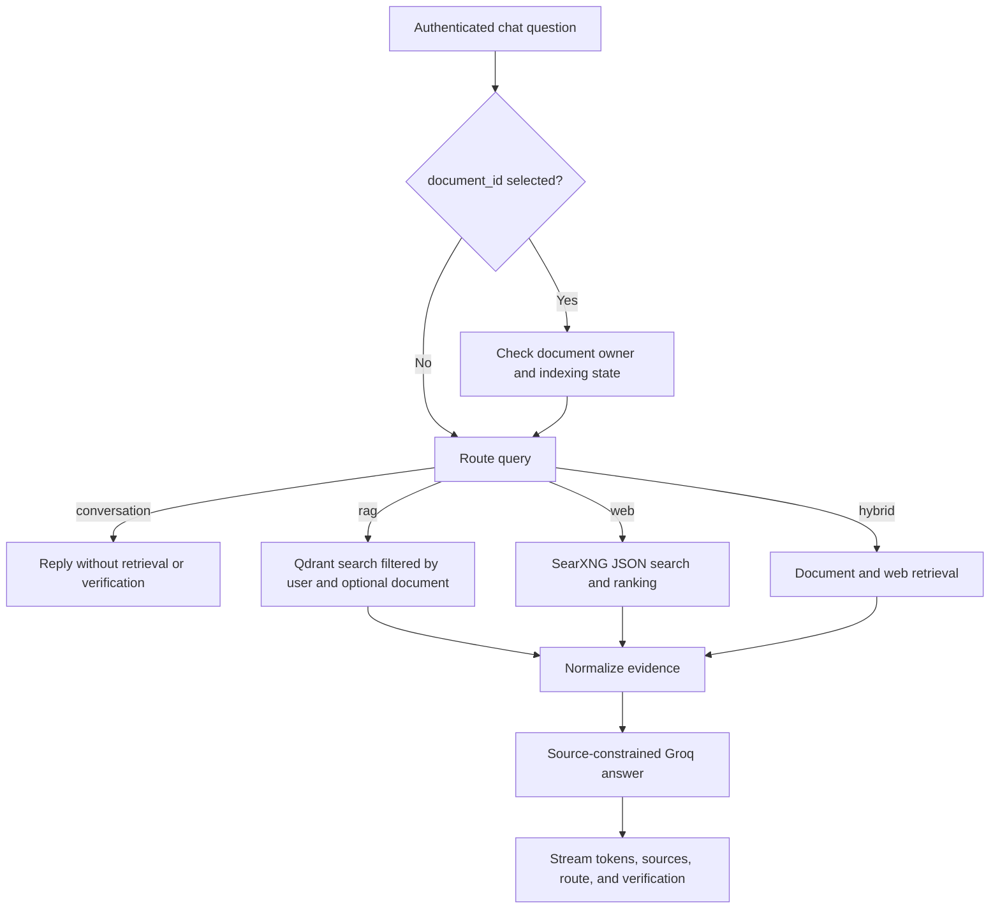

# AskLaw

AskLaw is a deployed legal research workspace. Users can research their own uploaded PDFs, search current web sources, and review streamed answers alongside source and claim-verification information. The application uses a React frontend, a FastAPI backend, MongoDB for accounts and documents, Qdrant for document vectors, and Celery for background indexing.

AskLaw provides educational and informational research assistance, not legal advice. Retrieved sources and the claim verifier help users inspect an answer; they do not establish that an answer is legally correct.

## Contents

- [Live demo and deployment](#live-demo-and-deployment)
- [What AskLaw does](#what-asklaw-does)
- [Architecture](#architecture)
- [Research pipeline](#research-pipeline)
- [Document lifecycle](#document-lifecycle)
- [Technology stack](#technology-stack)
- [Project structure](#project-structure)
- [Local setup](#local-setup)
- [Environment variables](#environment-variables)
- [API overview](#api-overview)
- [Document-scoped research](#document-scoped-research)
- [Verification](#verification)
- [Testing and evaluation](#testing-and-evaluation)
- [Security and limitations](#security-and-limitations)
- [Deployment notes](#deployment-notes)

## Live demo and deployment

| Part | Current deployment | Role |
| --- | --- | --- |
| Frontend | [askklaw.netlify.app](https://askklaw.netlify.app/) on Netlify | Vite-built React single-page application; `frontend/public/_redirects` supports direct route loads |
| API and indexing worker | [asklaw-api.onrender.com](https://asklaw-api.onrender.com/health) on one Render Free Web Service | FastAPI and one Celery worker run in the same backend container |
| Web search | [asklaw-searxng.onrender.com](https://asklaw-searxng.onrender.com/healthz) on a separate Render Free Web Service | SearXNG JSON search API at `/search` |
| Accounts, documents, conversations | MongoDB Atlas | Persistent MongoDB records |
| Document vectors | Qdrant Cloud | The Gemini collection is `asklaw_documents_gemini` |
| Task queue and results | Upstash Redis | TLS `rediss://` connections for Celery's broker and result backend |
| Embeddings | Gemini Embedding 2 | Batched, 3072-dimensional document and query embeddings |
| Answer generation | Groq | Streamed chat completions |
| Authentication email | Resend | Email verification and password-reset codes |
| Google sign-in | Google OAuth | Verified Google identity, linked to an AskLaw account |

The public deployment tracks the `deployment` branch. `main` contains the same passkey release as `deployment` at the time of this README update. This repository does not contain production credentials.

On 3 October 2026, the frontend returned HTTP `200`, `GET /health` returned `{"status":"healthy"}`, `GET /auth/providers` returned `{"google":true,"passkey":true}`, and SearXNG `/healthz` returned HTTP `200`. These checks confirm that the public endpoints responded at that time; they do not replace an authenticated end-to-end test.

## What AskLaw does

### Authentication and sessions

- Email/password signup sends a six-digit verification code through Resend. A pending account must verify its email before password sign-in.
- Forgot-password and reset-password use single-use, expiring email codes. A password reset increments the account's authentication version, invalidating older versioned tokens.
- Google OAuth verifies Google's ID token and links or creates a user using a verified email. The frontend receives an AskLaw session after exchanging a short-lived, one-time code.
- Signed-in users can register, list, and remove passkeys on the protected `/security` page. Registration requests a platform authenticator with a discoverable credential and user verification. Supported Mac and iPhone browsers can use Touch ID or Face ID; the browser and operating system control the biometric prompt.
- Password, Google, and passkey sign-in all issue the same AskLaw access token and HttpOnly refresh cookie. The access token is held in browser `localStorage`; the refresh cookie uses `SameSite=Lax` and the `/auth` path.
- The frontend restores protected sessions with `/auth/me` and performs one shared refresh attempt after an authenticated request receives `401`.
- Passkeys are bound to their WebAuthn relying-party domain. A passkey registered for `localhost` does not sign in to `askklaw.netlify.app`; users register a production passkey separately.

### Document workspace

- A persistent, newest-first library shows only the authenticated user's PDF records.
- Upload validates a PDF filename and MIME type, then extracts text and page-aware chunks in the API request. Celery embeds those chunks and indexes them in Qdrant in the background.
- The Documents page shows `uploaded`, `processing`, `indexed`, and `failed` states, polls while indexing is in progress, and offers Research when a document is ready.
- Users can delete an owned document after processing finishes. The backend removes its Qdrant points before removing its MongoDB record.

### Research chat

- Conversations and message history are stored in MongoDB and scoped to the authenticated user.
- The deterministic query router chooses conversational, document RAG, web, or hybrid research. A clearly casual greeting bypasses retrieval and has no sources or grounding score.
- A general question can use web search without an uploaded document. An unscoped RAG query with no document results falls back to web retrieval; a selected document remains scoped to that document.
- The chat streams answer tokens and then backend-created source, route, and verification metadata. Document sources and web sources are displayed separately, including hybrid answers.
- The frontend shows claim support (`supported`, `partial`, or `unsupported`) and a grounding score when research verification data is returned.

## Architecture


```mermaid
flowchart LR
    Browser[Netlify React frontend] -->|Bearer token and refresh cookie| API[Render FastAPI]
    API --> Mongo[(MongoDB Atlas)]
    API --> Qdrant[(Qdrant Cloud)]
    API --> Redis[(Upstash Redis)]
    Redis --> Worker[Celery worker in the API container]
    Worker --> Mongo
    Worker --> Qdrant
    API --> Search[SearXNG on separate Render service]
    API --> Groq[Groq]
    API --> Google[Google OAuth]
    API --> Resend[Resend]
    API --> Gemini[Gemini embeddings]
    Worker --> Gemini
```

The Render backend image runs `backend/docker/start.sh`: one Celery worker (`solo`, concurrency 1) and one Uvicorn worker bound to `0.0.0.0:$PORT`. This is the project's Render Free demo arrangement; there is no paid Background Worker service. If either child process exits, the script stops the other so Render can restart the container.

The web retrieval path imports AskLaw's `search_web` MCP tool function directly into the API process and calls the separate SearXNG service. Local development also starts a standalone MCP server, but the public Render command does not start a separate MCP process. The `compose.production.yml` stack is a separate container-based deployment option in the repository, not the current Netlify/Render deployment.

## Research pipeline


```mermaid
flowchart TD
    Q[Authenticated chat question] --> D{document_id selected?}
    D -->|Yes| O[Check document owner and indexing state]
    D -->|No| R[Route query]
    O --> R
    R -->|conversation| C[Reply without retrieval or verification]
    R -->|rag| V[Qdrant search filtered by user and optional document]
    R -->|web| W[SearXNG JSON search and ranking]
    R -->|hybrid| H[Document and web retrieval]
    V --> E[Normalize evidence]
    W --> E
    H --> E
    E --> G[Source-constrained Groq answer]
    G --> S[Stream tokens, sources, route, and verification]
```

The router recognizes legal provision and document wording, current-event wording, general questions, and a narrow set of complete casual utterances. Web research can expand a recent legal question into targeted searches and rank the results. The backend creates source metadata from retrieved material rather than accepting generated citations as the source list. With no usable evidence, the answer path is constrained to acknowledge that limitation.

## Document lifecycle

1. `POST /documents/upload` receives a multipart `file` field from an authenticated user. It checks the PDF filename, `application/pdf` MIME type, upload size, page count, and extracted-text size.
2. `pypdf` extracts selectable text page by page. AskLaw stores the text, page-aware chunks, metadata, owner ID, and initial `uploaded` status in the existing MongoDB `documents` collection. It does not keep the original PDF binary.
3. The API submits an indexing task to Celery through Redis. The worker claims the record, sets `processing`, batches embeddings, and writes vectors with `user_id`, `document_id`, filename, page number, and chunk index in the Qdrant payload.
4. The worker marks the record `indexed` on success or `failed` after an unrecoverable error or exhausted retries. The Documents page refreshes its list while an upload is pending.
5. Research requires an indexed, owned document. Deletion is blocked while a record is `uploaded` or `processing`.

Chunks are 1,000 characters with 150 characters of overlap. The local MiniLM option produces 384-dimensional vectors in its own collection. The Gemini option uses `gemini-embedding-2`, 3072 dimensions, a separate `asklaw_documents_gemini` collection, and a configurable batch size (default 32). AskLaw validates an existing collection's vector size rather than changing it. The Gemini Docker image omits PyTorch, Sentence Transformers, and the local model weights.

## Technology stack

| Layer | Implementation |
| --- | --- |
| Frontend | React 19, React Router 7, Vite 8, Axios, React Markdown, Tailwind CSS 4 |
| API | FastAPI, Pydantic, Uvicorn, Python 3.12 production image |
| Persistence | PyMongo and MongoDB Atlas in the public deployment |
| Vector search | Qdrant client and Qdrant Cloud in the public deployment |
| Embeddings | Gemini Embedding 2 in production; optional local MiniLM provider |
| Background work | Celery with Redis broker and result backend |
| Web search | SearXNG JSON API through the AskLaw MCP search tool function |
| Generation | Groq API |
| Authentication | bcrypt, JWT access/refresh tokens, Google OAuth, email OTP, WebAuthn passkeys |
| PDF extraction | `pypdf` |
| Hosting | Netlify frontend, Render API/Celery and SearXNG, external managed data services |

## Project structure

```text
AskLaw/
├── backend/
│   ├── app/api/                 # Auth, document, conversation, chat, health routes
│   ├── app/core/                # Settings, dependencies, Celery
│   ├── app/db/                  # MongoDB collections and indexes
│   ├── app/mcp/                 # SearXNG-backed search tool
│   ├── app/services/            # Auth, document, retrieval, generation, verification
│   ├── app/tasks/               # Background document indexing
│   ├── docker/start.sh          # Combined Render API/Celery startup
│   ├── evaluation/              # Offline and live evaluation harness
│   ├── tests/                   # Backend tests
│   ├── Dockerfile
│   └── requirements-gemini.txt  # Smaller Gemini production dependency set
├── frontend/
│   ├── public/_redirects        # Netlify SPA route fallback
│   ├── src/pages/               # Landing, auth, dashboard, documents, security
│   ├── src/components/          # Workspace, chat, and auth UI
│   ├── src/hooks/               # Streaming chat and conversation state
│   ├── src/services/            # API, auth, chat, passkey clients
│   ├── tests/                   # Frontend tests
│   └── vercel.json              # Alternative Vercel SPA rewrite
├── deploy/searxng/              # Separate Render SearXNG image and settings
├── compose.production.yml       # Alternative self-hosted production stack
├── docker-compose.yml           # Local MongoDB, Qdrant, Redis, SearXNG
├── start.sh                      # Starts the local application stack
└── stop.sh                       # Stops the local application stack
```

## Local setup

You need Python, Node.js/npm, Docker Compose, and credentials for the features you want to exercise. The production Dockerfile uses Python 3.12; the frontend Dockerfile builds with Node 22. MongoDB, Qdrant, Redis, and SearXNG can run locally through the root Compose file.

```bash
git clone https://github.com/akhhilreddy/AskLaw.git
cd AskLaw/backend
python3 -m venv .venv
source .venv/bin/activate
python -m pip install -r requirements.txt
cp .env.example .env
cd ../frontend
npm ci
cp .env.example .env
cd ..
```

Before startup, edit `backend/.env`. Set a non-default `SECRET_KEY` and a `GROQ_API_KEY` for generated answers. The checked-in backend example selects Gemini embeddings but leaves `GEMINI_API_KEY` empty; supply that key or switch to `EMBEDDING_PROVIDER=local` with a 384-dimensional local collection. Email signup and password reset require `RESEND_API_KEY` and a verified `EMAIL_FROM` sender. Google sign-in requires its client ID, secret, and callback URI. Passkeys use the local frontend origin and RP ID derived from `FRONTEND_URL` unless explicitly overridden. Keep all credentials in untracked environment files or hosting settings.

Then start the local stack:

```bash
./start.sh
```

Open `http://localhost:5173`; the API docs are at `http://localhost:8000/docs`. The local script starts Docker services, FastAPI, Celery, a local MCP server, and Vite. Stop it with `Ctrl+C` or `./stop.sh`. The root Compose file uses named data volumes by default; optional `ASKLAW_MONGODB_DATA` and `ASKLAW_QDRANT_DATA` overrides retain existing bind-mounted data.

## Environment variables

The backend settings are defined in [`backend/app/core/config.py`](backend/app/core/config.py). The checked-in [`backend/.env.example`](backend/.env.example) is for local development; [`deploy/production.env.example`](deploy/production.env.example) is a secret-free example for the alternative Compose stack. The public Render service uses its own environment settings.

| Group | Backend variables | Purpose |
| --- | --- | --- |
| App and sessions | `APP_ENV`, `SECRET_KEY`, `ALGORITHM`, `ACCESS_TOKEN_EXPIRE_MINUTES`, `REFRESH_TOKEN_EXPIRE_DAYS`, `COOKIE_SECURE`, `ALLOW_LEGACY_UNTYPED_REFRESH_TOKENS` | JWT/session settings and production checks |
| Browser origins | `FRONTEND_URL`, `CORS_ORIGINS` | Frontend redirects and allowed credentialed requests |
| Email codes | `RESEND_API_KEY`, `EMAIL_FROM`, `EMAIL_OTP_SECRET`, `EMAIL_OTP_EXPIRE_MINUTES`, `EMAIL_OTP_MAX_ATTEMPTS`, `EMAIL_OTP_RESEND_COOLDOWN_SECONDS` | Verification and password reset |
| Google OAuth | `GOOGLE_CLIENT_ID`, `GOOGLE_CLIENT_SECRET`, `GOOGLE_REDIRECT_URI`, `GOOGLE_OAUTH_STATE_EXPIRE_MINUTES`, `GOOGLE_OAUTH_EXCHANGE_EXPIRE_MINUTES` | Google sign-in and one-time frontend exchange |
| Passkeys | `WEBAUTHN_RP_ID`, `WEBAUTHN_RP_NAME`, `WEBAUTHN_ORIGIN`, `WEBAUTHN_CHALLENGE_EXPIRE_MINUTES` | WebAuthn domain, display name, and challenge lifetime |
| MongoDB | `MONGODB_URL`, `MONGODB_DATABASE` | Users, auth records, documents, conversations |
| Qdrant | `QDRANT_URL`, `QDRANT_API_KEY`, `QDRANT_COLLECTION_NAME` | Vector collection and hosted Qdrant authentication |
| Embeddings | `EMBEDDING_PROVIDER`, `EMBEDDING_MODEL`, `GEMINI_API_KEY`, `GEMINI_EMBEDDING_BATCH_SIZE` | Local or Gemini provider and batch size |
| Chat | `GROQ_API_KEY` | Answer generation |
| Celery | `CELERY_BROKER_URL`, `CELERY_RESULT_BACKEND` | Redis broker and result backend; TLS is configured for `rediss://` URLs |
| Web search | `SEARXNG_URL` | Full JSON endpoint, including `/search` |
| Local MCP server | `MCP_HOST`, `MCP_PORT` | Standalone local MCP listener |
| Upload limits | `MAX_DOCUMENT_UPLOAD_BYTES`, `MAX_DOCUMENT_PAGES`, `MAX_DOCUMENT_TEXT_BYTES` | PDF request and extraction caps |

The Netlify build needs `VITE_API_BASE_URL=https://asklaw-api.onrender.com`. This Vite variable is embedded at build time. In Render, the frontend origin is `https://askklaw.netlify.app`, the Google callback is `https://asklaw-api.onrender.com/auth/google/callback`, `WEBAUTHN_ORIGIN` is `https://askklaw.netlify.app`, `WEBAUTHN_RP_ID` is `askklaw.netlify.app`, and `SEARXNG_URL` is `https://asklaw-searxng.onrender.com/search`. `APP_ENV=production` also requires HTTPS WebAuthn origin, a secure cookie, explicit CORS origins, configured Resend sender/key, and a non-default secret of at least 32 characters. Qdrant Cloud requires `QDRANT_API_KEY` in production.

Set `SEARXNG_SECRET`, `SEARXNG_BASE_URL`, `SEARXNG_PORT=10000`, and `SEARXNG_BIND_ADDRESS=0.0.0.0` on the separate SearXNG Render service. See [`deploy/searxng/README.md`](deploy/searxng/README.md) for that service's setup. Do not place secret values in this README or Git.

## API overview

| Route | Access | Purpose |
| --- | --- | --- |
| `GET /health` | Public | API health |
| `GET /auth/providers` | Public | Advertise configured Google and passkey options |
| `POST /auth/signup`, `/auth/verify-email`, `/auth/resend-verification` | Public | Email account and verification flow |
| `POST /auth/forgot-password`, `/auth/reset-password` | Public | Email-code password recovery |
| `POST /auth/login`, `/auth/token`, `/auth/refresh`, `/auth/logout` | Login or refresh flow | AskLaw access token and refresh cookie |
| `GET /auth/google/start`, `/auth/google/callback`; `POST /auth/google/exchange` | Google OAuth flow | Verified Google account and AskLaw session |
| `POST /auth/passkeys/register/options`, `/auth/passkeys/register/verify` | Bearer access token | Register a passkey on the signed-in account |
| `POST /auth/passkeys/authenticate/options`, `/auth/passkeys/authenticate/verify` | Public | Sign in with a registered passkey |
| `GET /auth/passkeys`, `DELETE /auth/passkeys/{credential_id}` | Bearer access token | List or remove owned passkeys |
| `GET /auth/me` | Bearer access token | Current user profile |
| `GET /documents` | Bearer access token | Newest-first list of owned documents |
| `POST /documents/upload` | Bearer access token | Multipart PDF `file` upload and indexing task |
| `DELETE /documents/{document_id}` | Bearer access token | Remove an owned document and its vectors |
| `/conversations/` and `/conversations/{conversation_id}` | Bearer access token | Create, list, read, rename, and delete owned conversations |
| `POST /chat/stream` | Bearer access token | NDJSON answer, sources, route, and verification events |

The backend derives the user ID from the validated token. It never treats a client-supplied `user_id` as proof of ownership.

## Document-scoped research

Clicking **Research** on an indexed document opens `/dashboard?document_id=<id>`. The selected ID survives refresh, and the chat request carries it to `/chat/stream`. The API first checks that the document belongs to the signed-in user and is indexed. Qdrant document retrieval filters by both `user_id` and `document_id`; unscoped document retrieval still filters by `user_id`. Missing and unowned documents are both reported as not found.

A selected document limits the document side of RAG or hybrid retrieval. A web-only question can still use web sources. Normal chat without a selected document retains its usual conversation and retrieval behavior.

## Verification

For research answers, the backend compares generated claims with the retrieved evidence and reports `supported`, `partial`, or `unsupported` results plus a grounding score. The chat displays document pages, web URLs, source grouping, and the verification summary when present. Casual conversation has no retrieval sources or verification block. A research answer with no returned sources displays that absence rather than inventing evidence.

Verification measures support in retrieved material. It is a deterministic check, not a legal correctness guarantee or a substitute for reviewing the cited material.

## Testing and evaluation

From the repository root, use the existing isolated tests and build checks:

```bash
cd backend
.venv/bin/python -m compileall -q app tests evaluation
.venv/bin/python -m unittest discover -s tests -p 'test_*.py'
cd ../frontend
node --test tests/*.test.js
npm run lint
npm run build
cd ..
git diff --check
```

The backend tests cover document ownership, indexing, retrieval routes, web search, claim verification, email auth, Google OAuth, passkeys, and Redis TLS configuration. The frontend tests cover authentication error handling and chat presentation. [`backend/tests/README.md`](backend/tests/README.md) describes a live, two-account workflow. [`backend/evaluation/README.md`](backend/evaluation/README.md) explains the offline and live retrieval evaluation harness. Run the offline harness with:

```bash
cd backend
.venv/bin/python evaluation/run_evaluation.py
```

Public endpoint checks:

```bash
curl --fail --show-error https://asklaw-api.onrender.com/health
curl --fail --show-error https://asklaw-api.onrender.com/auth/providers
curl --fail --show-error https://asklaw-searxng.onrender.com/healthz
curl --fail --show-error 'https://asklaw-searxng.onrender.com/search?q=India&format=json'
```

Render Free services may take time to wake after inactivity. An authenticated smoke test should also cover email or Google sign-in, passkey registration and login, a small text-based PDF moving to `indexed`, document Research, web research, and deletion.

## Security and limitations

- Access and refresh JWTs have distinct purposes. Protected routes require an access token; refresh uses an HttpOnly cookie. Production sets `COOKIE_SECURE=true`, uses explicit CORS origins, and checks browser origins on cookie-sensitive authentication endpoints.
- MongoDB document, conversation, and passkey records are scoped to the authenticated user. Qdrant retrieval and deletion include an owner filter.
- Email codes, Google exchange codes, and passkey challenges are short-lived and single-use. WebAuthn verifies the origin, relying-party ID, challenge, and user verification.
- PDF uploads have filename, MIME, size, page, and extracted-text checks. Image-only/scanned PDFs are not searchable because OCR is not implemented.
- The browser access token is stored in `localStorage`. Refresh tokens are not rotated or individually revoked server-side; logout clears the browser cookie. Password reset invalidates versioned tokens by incrementing `auth_version`.
- There is no built-in distributed rate limiter. The claim verifier is deterministic and cannot prove legal correctness. Web search uses SearXNG result metadata/snippets rather than parsing every destination page.
- PDF extraction and chunking happen during the upload request. Large files, Gemini free-tier quotas, upstream search availability, and Render Free resource/sleep limits can affect the demo. The combined API/Celery process is a small-demo deployment arrangement, not a scaling design.

## Deployment notes

- Netlify builds `frontend/` with `npm run build` and serves `frontend/dist`. `frontend/public/_redirects` maps SPA routes to `index.html`. The checked-in `frontend/vercel.json` is an alternative rewrite for Vercel and is not the current host.
- Render builds `backend/Dockerfile` in Gemini mode and starts its default `backend/docker/start.sh`. The API binds `$PORT`; Celery uses one `solo` worker in the same container. `GET /health` is the API health endpoint.
- A second Render Docker service builds `deploy/searxng/Dockerfile`, listens on port `10000`, and exposes JSON search plus `/healthz`. AskLaw's API must use the `/search` URL, not the SearXNG site root.
- MongoDB Atlas, Qdrant Cloud, and Upstash Redis are external to Render. The backend uses authenticated Qdrant requests and verified TLS for `rediss://` broker and result-backend URLs.
- The root `compose.production.yml` and [`deploy/README.md`](deploy/README.md) describe an alternative self-hosted stack. They are not the infrastructure currently serving the public demo.
- Netlify and Render deployment settings and third-party dashboards hold production values. The repository contains examples and code, not production secrets or a restorable cloud deployment snapshot.
